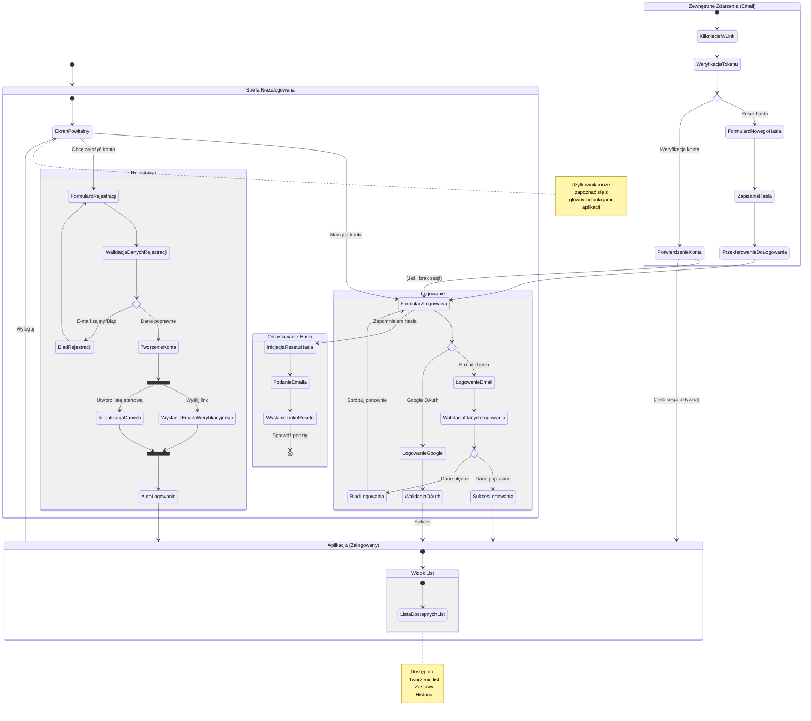

<user_journey_analysis>
1. **Ścieżki użytkownika (User Paths):**
   - **Nowy Użytkownik:** Wejście na stronę -> Rejestracja (E-mail/Hasło) -> Automatyczne utworzenie domyślnej listy -> Automatyczne zalogowanie -> Dostęp do aplikacji.
   - **Powracający Użytkownik (E-mail):** Wejście na stronę -> Logowanie (E-mail/Hasło) -> Walidacja -> Dostęp do aplikacji.
   - **Użytkownik Google:** Wejście na stronę -> Logowanie/Rejestracja przez Google (OAuth) -> Dostęp do aplikacji.
   - **Zapomniane Hasło:** Ekran logowania -> "Zapomniałem hasła" -> Podanie e-maila -> Odebranie wiadomości -> Kliknięcie linku -> Ustawienie nowego hasła -> Logowanie.
   - **Weryfikacja E-mail:** Rejestracja -> Otrzymanie e-maila weryfikacyjnego (w tle lub wymagane) -> Kliknięcie linku -> Potwierdzenie konta.
   - **Niezalogowany Użytkownik:** Dostęp do strony głównej (Landing Page), brak dostępu do list zakupów (wymaga logowania).

2. **Główne podróże i stany:**
   - **Autentykacja:** Stan początkowy, obejmuje wybór metody (Logowanie/Rejestracja).
   - **Proces Logowania:** Wprowadzanie danych, walidacja, obsługa błędów, OAuth.
   - **Proces Rejestracji:** Formularz, walidacja, tworzenie konta, inicjalizacja danych (lista startowa).
   - **Odzyskiwanie Dostępu:** Flow resetowania hasła.
   - **Aplikacja (Zalogowany):** Główny widok list, dostęp do funkcjonalności biznesowych.

3. **Punkty decyzyjne:**
   - Czy użytkownik ma konto? (Logowanie vs Rejestracja).
   - Czy dane logowania są poprawne?
   - Czy rejestracja się powiodła (unikalny email)?
   - Czy logowanie następuje przez Google czy E-mail?
   - Czy token (weryfikacyjny/resetu) jest ważny?

4. **Cel stanów:**
   - `EkranPowitalny`: Punkt wejścia, informacja o aplikacji, wybór akcji.
   - `FormularzLogowania` / `FormularzRejestracji`: Zbieranie danych uwierzytelniających.
   - `Aplikacja`: Umożliwienie korzystania z funkcji biznesowych (listy zakupów).
</user_journey_analysis>

<mermaid_diagram>

</mermaid_diagram>
